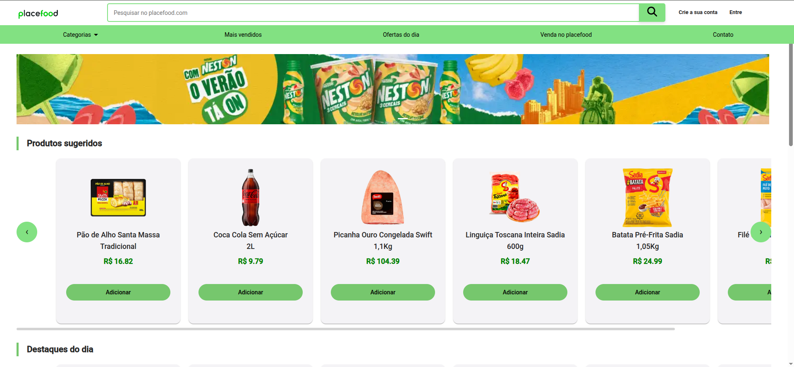
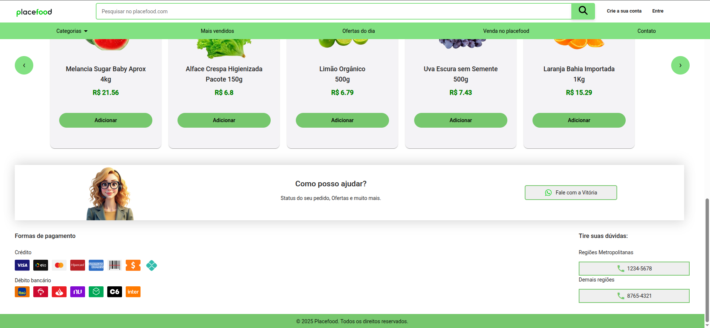
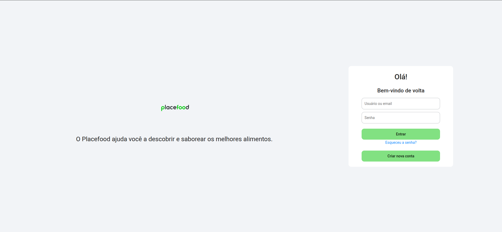
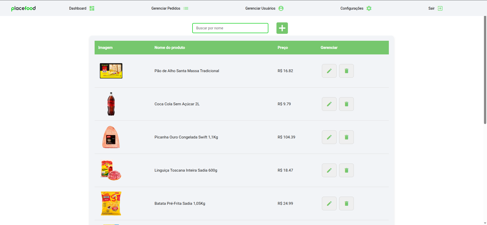
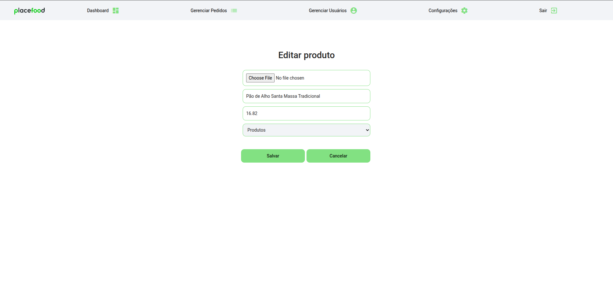

# Placefood

Este projeto foi gerado usando [Angular CLI](https://github.com/angular/angular-cli) versão 19.1.4.

## Como Executar

1. Certifique-se de ter o Node.js instalado em sua máquina.
2. Abra o terminal e navegue até o diretório raiz do projeto.
3. Execute o seguinte comando para instalar as dependências do projeto:

    ```
    npm install
    ```

## Servidor de desenvolvimento

Para iniciar um servidor de desenvolvimento local, execute no terminal dentro da pasta do projeto:

```bash
ng serve
```

Depois que o servidor estiver em execução, abra seu navegador e navegue até `http://localhost:4200/`. O aplicativo será recarregado automaticamente sempre que você modificar qualquer um dos arquivos de origem.

Para rodar a API e conseguir fazer as manipulações de CRUD, execute no terminal dentro da pasta do projeto:

```bash
npm run server
```

## Usuário administrador

Na tela de login, basta digitar "admin" no campo de usuário e senha para conseguir acessar as próximas páginas

<h1 align="center"> Placefood </h1>

<p align="center">
O Placefood é um e-commerce de alimentos onde você pode selecionar os melhores produtos e recebê-los em sua casa
</p>

> ⚠️ Este projeto foi desenvolvido apenas para fins de estudo e aprendizado. Não se trata de uma aplicação em produção.

<br>


<p align="center">
  
  
  
  
  
  

</p>

## 🖥️ Tecnologias

Esse projeto foi desenvolvido com as seguintes tecnologias:

- Angular
- HTML e CSS
- TypeScript
- Podman
- Git, Github e GitLab
